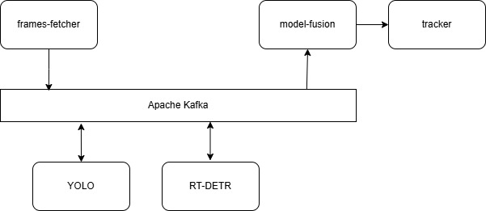

# Pedestrians tracker

## About project
This is my Master's thesis project where I created human 
tracking system using multi-model fusion and distributed 
processing.

I ensembled results from YOLO and RT-DETR models utilizing 
Weighted Box Fusion 

Dataset used to train models: 
- https://universe.roboflow.com/magisterka-g7tqf/pedestrian-detector-ywj1e

## Project architecture

- frames-fetcher – fetches frames from the video stream and sends them to Kafka.
- YOLO and RT-DETR – machine vision models that detect pedestrians.
- model-fusion – ensembles detections from YOLO and RT-DETR.
- tracker – receives fused detections, tracks objects, and displays results.